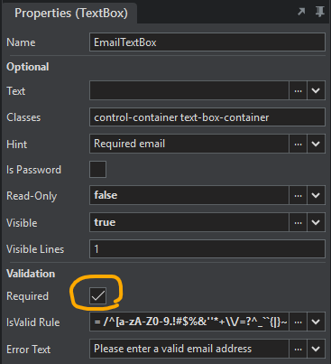

# Validation Expressions Cheat Sheet <!-- omit in toc -->

The release of Stadium 6.12 brings some changes to how field validations work in Stadium. Instead of a simple selection from a limited set of predefined options, we can now use expressions to flexibly validate control values and properties as well as the values and properties of related controls. 

This readme describes how to create validations in Stadium 6.12+. When upgrading a pre- 6.12 application in the 6.12 Stadium Designer, older validations will automatically be upgraded. 

## Contents <!-- omit in toc -->
- [Required / Not Required](#required--not-required)
- [IsValid Rule](#isvalid-rule)
  - [Copy-and-Paste Expressions](#copy-and-paste-expressions)
    - [IsEmail](#isemail)
    - [IsAmount](#isamount)
    - [IsNumber](#isnumber)
    - [IsURL](#isurl)
    - [Text length is 8 or more](#text-length-is-8-or-more)
    - [Password validation](#password-validation)
    - [Characters only](#characters-only)
    - [Combining Multiple Criteria](#combining-multiple-criteria)
  - [Use AI to generate a RegEx](#use-ai-to-generate-a-regex)
- [Date Validations](#date-validations)
  - [Date Range (DatePicker)](#date-range-datepicker)
- [Number Validations](#number-validations)
  - [Number Range](#number-range)

## Stadium Version
Ths readme applies to Stadium versions 6.12+

# Required / Not Required
To mark a field as required, check the "Required" checkbox and enter a validation message



# IsValid Rule
A wide range of validations can be performed with the help of expressions. 

## Copy-and-Paste Expressions
However, regular expressions are not always easy to write. Here are regular expressions for all current Stadium validations. 

To use these examples, adjust the fieldname ('TextBox' in this example) and copy & paste any of these expressions into the "IsValid" rule in the properties panel

### IsEmail
Required
```javascript
/^(([^<>()[\]\\.,;:\s@"]+(\.[^<>()[\]\\.,;:\s@"]+)*)|.(".+"))@((\[[0-9]{1,3}\.[0-9]{1,3}\.[0-9]{1,3}\.[0-9]{1,3}\])|(([a-zA-Z\-0-9]+\.)+[a-zA-Z]{2,}))$/.test(TextBox.Text)
```

### IsAmount
Required
```javascript
/^\d+(\.\d{1,2})?$/.test(TextBox.Text)
```

### IsNumber
Required
```javascript
/^\d+$/.test(TextBox.Text)
```

### IsURL
Required & with http / https
```javascript
/https?:\/\/[-a-z0-9@:%._\+~#=]{1,256}\.[a-z0-9()]{1,6}\b([-a-z0-9()@:%_\+.~#?&//=]*)/i.test(TextBox.Text)
```

### Text length is 8 or more
Required
```javascript
TextBox.Text.length > 7
```

### Password validation
Rules: 8 – 16 characters, at least one number, at least one special character
```javascript
/^(?=.*[\d])(?=.*[!@#$%^&*])[\w!@#$%^&*]{8,16}$/.test(TextBox.Text)
```

### Characters only
Required
```javascript
/^[a-zA-Z]*$/.test(TextBox.Text)
```

### Combining Multiple Criteria
To require values to adhere to multiple criteria (x AND y), the criteria can be combined by adding a double ampersand (&&)

Example
```javascript
TextBox.Text > 0 && TextBox.Text < 13
```

To require values to adhere to any listed criteria (x OR y), the criteria can be combined by adding a double pipe (||)

Example
```javascript
TextBox.Text > 0 || TextBox.Text < 13
```

## Use AI to generate a RegEx
If you need a specific RegEx, but are not sure how to write it, I came across a function in the Google Gemini AI tool that will generate a RegEx from a text prompt. 

[Google AI Studio RegEx Text Prompt](https://aistudio.google.com/app/prompts/regexed)

Here is an example prompt for a complex RegEx:

```text
Give me a JavaScript regex that checks a string for the following:
The string must have 8-24 characters.
The string must contain upper and lowercase characters.
The string must contain at least one number.
The string must have at least one of the following special characters: ~!@#$%^&*()_+=-:;<,>.?
```

The result:
```javascript
/^(?=.*[a-z])(?=.*[A-Z])(?=.*\d)(?=.*[~!@#$%^&*()_+=-:;<,>.?]).{8,24}$/
```

Implementing this as a Stadium Validation:

Required
```javascript
/^(?=.*[a-z])(?=.*[A-Z])(?=.*\d)(?=.*[~!@#$%^&*()_+=-:;<,>.?]).{8,24}$/.test(TextBox.Text)
```

# Date Validations

## Date Range (DatePicker)
Required & date between Jan 1, 2023 & today
```javascript
DatePicker.Date > new Date('01/01/2023') && DatePicker.Date < new Date()
```

# Number Validations

## Number Range
Required & number between 1 and 12
```javascript
TextBox.Text > 0 && TextBox.Text < 13
```
